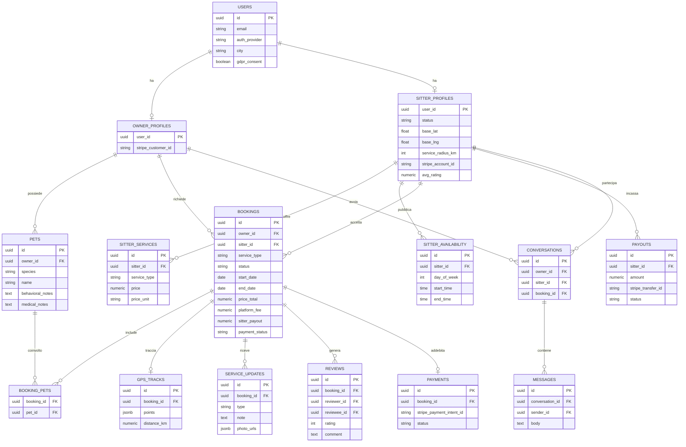

# Fido — Blueprint MVP (Fase 1)

> Proposta di architettura per il marketplace pet-sitting italiano (nome di lavoro: "Fido"). Bozza per revisione — versione interattiva con diagramma: vedi artifact pubblicato in chat.
>
> **Nota sul repository:** questo repo contiene attualmente un CRM farmaceutico non correlato (`index.html`, `catalogo.json`, script Gmail/agente di stampa). Il progetto pet-sitting viene aggiunto in cartelle nuove (`mobile/`, `backend/`, `admin/`, `shared/`) senza toccare quei file.

## §00 Raccomandazione di stack backend

Ibrido **Supabase + Node/Express sottile**, non uno dei due puri:

- **Supabase copre**: Postgres, Auth (email/password + Google/Apple OAuth pronti), Storage S3-compatibile, canali realtime per chat e GPS live, estensione PostGIS per ricerca geografica, RLS per permessi owner/sitter/admin.
- **`/backend` (Node + Express + TS) copre**: Stripe Connect (onboarding sitter, payment intent con split commissione), webhook pagamenti/payout, macchina a stati delle prenotazioni, operazioni admin privilegiate — tutto ciò che non è sicuro delegare a RLS lato client.

Motivazione: costruire da zero autenticazione, storage e infrastruttura realtime con Express puro richiederebbe settimane in più per un MVP che deve validare il mercato in pochi mesi con budget limitato. Costo indicativo: Supabase Pro (~25 $/mese) + hosting minimo per Express su Railway/Render (~7-20 $/mese).

Compromesso accettato: un minimo di lock-in verso Supabase e due backend invece di uno solo — da rivalutare a Serie A se serve più controllo infrastrutturale.

## §01 Schema del database

Postgres gestito da Supabase. Chiavi primarie `uuid`, timestamp `created_at`/`updated_at` impliciti su tutte le tabelle.



### Decisioni di design da segnalare

- **Un utente, due profili opzionali.** `owner_profiles` e `sitter_profiles` estendono `users` invece di duplicare i dati — chi cammina un cane il lunedì può prenotarne uno il martedì, come su Rover.
- **`sitter_profiles.status`** (`pending → approved/rejected`) implementa l'accettazione selettiva stile PetBnb: nessun sitter è visibile in ricerca finché un admin non approva — utile per costruire fiducia iniziale su un mercato piccolo.
- **Commissione trasparente in chiaro.** `bookings` registra `price_total`, `platform_fee` e `sitter_payout` come colonne esplicite (non calcolate a runtime), così l'app può mostrare il breakdown prima del pagamento — la lamentela ricorrente su Rover è la commissione "nascosta fino al checkout".
- **GPS come JSONB, non tabella normalizzata.** `gps_tracks.points` è un array di punti `{lat,lng,t}`. Per l'MVP evita una tabella con migliaia di righe per passeggiata; da rivalutare se serve query analitiche sui percorsi.
- **Ricerca geografica** via estensione PostGIS su `sitter_profiles.base_lat/lng` + `service_radius_km`, con funzione Postgres `nearby_sitters(lat, lng, service_type)` richiamata dall'API di ricerca.
- **Prenotazioni ricorrenti** (dog walking 3x/settimana) tramite `bookings.recurrence_rule` (pattern semplice tipo `WEEKLY;MON,WED,FRI`) che genera occorrenze figlie, non un evento RRULE completo — sufficiente per l'MVP.
- **Meet & Greet** è una tabella separata e leggera (non una `booking` senza pagamento), perché è gratuito e ha un ciclo di vita diverso (richiesta → proposta → accettata).

### Inventario completo tabelle

| Tabella | Scopo | Ambito |
|---|---|---|
| `users` | Identità unica, ruolo di base, consenso GDPR | core |
| `owner_profiles` | Estensione proprietario: indirizzo, Stripe customer | core |
| `sitter_profiles` | Estensione sitter: verifica, zona, Stripe Connect, rating | core |
| `pets` | Profilo animale: specie, note comportamentali/mediche | core |
| `sitter_services` | Servizi offerti dal sitter con tariffa per tipologia | core |
| `sitter_availability` | Disponibilità ricorrente settimanale | core |
| `availability_exceptions` | Blocchi/sblocchi su date specifiche | supporto |
| `bookings` | Prenotazione: stato, prezzo, commissione, pagamento | core |
| `booking_pets` | Animali coinvolti in una prenotazione (n:m) | core |
| `meet_greet_requests` | Incontro conoscitivo gratuito pre-prenotazione | core |
| `cancellation_policies` | Politiche di cancellazione per sitter | supporto |
| `gps_tracks` | Traccia GPS di una passeggiata | core |
| `service_updates` | Foto/video/note inviate dal sitter durante il servizio | core |
| `conversations` / `messages` | Chat in-app owner↔sitter | core |
| `reviews` | Recensioni bidirezionali legate a una prenotazione | core |
| `payments` | Log addebiti/rimborsi legati a Stripe PaymentIntent | core |
| `payouts` | Trasferimenti verso il conto sitter (Stripe Connect) | core |
| `verification_documents` | Documento identità caricato dal sitter, stato revisione | supporto |
| `notifications` / `push_tokens` | Notifiche in-app e token FCM per dispositivo | supporto |
| `incident_reports` | Segnalazione incidente per attivare la garanzia base | supporto |
| `disputes` | Contestazioni aperte da owner/sitter, gestite da admin | admin |
| `admin_action_logs` | Audit trail delle azioni di moderazione | admin |

**Da decidere prima dell'implementazione:** massimale della garanzia spese veterinarie per l'MVP. Per il pilota si consiglia un tetto fisso e basso (es. 500-1000 €) gestito manualmente via `incident_reports` + revisione admin, senza integrare un vero prodotto assicurativo finché il volume non lo giustifica.

## §02 Struttura del progetto

Monorepo con workspace npm/pnpm. Le cartelle esistenti nella root del repository (CRM farmaceutico) restano invariate.

```
# root del repo — contenuto CRM esistente non toccato
mobile/                     # React Native (Expo)
├── app/                    # Expo Router — rotte/schermate
│   ├── (auth)/
│   ├── (owner)/            # ricerca, prenotazioni, chat
│   ├── (sitter)/           # dashboard, calendario, guadagni
│   └── (shared)/           # profilo, notifiche, impostazioni
├── src/
│   ├── features/           # auth, pets, search, booking, chat, reviews, payments
│   ├── components/
│   ├── services/           # client Supabase, client API, SDK Stripe
│   ├── store/               # stato globale (Zustand)
│   ├── navigation/
│   ├── theme/
│   └── i18n/                # it.json (default), en.json
├── app.json / eas.json
└── package.json

backend/                    # Node + Express + TS — servizi complementari a Supabase
├── src/
│   ├── modules/
│   │   ├── stripe-connect/  # onboarding sitter, payment intent, split commissione
│   │   ├── webhooks/         # eventi Stripe (payment, payout, account)
│   │   ├── bookings/         # macchina a stati, prenotazioni ricorrenti
│   │   └── admin/             # operazioni privilegiate (approvazione sitter, dispute)
│   ├── middleware/            # auth guard (verifica JWT Supabase), rate limit
│   ├── lib/                    # client Supabase (service role), utility geo
│   └── server.ts
├── supabase/
│   ├── migrations/            # schema SQL versionato
│   ├── functions/              # Edge Function (alternativa leggera a Express)
│   └── seed.sql
└── package.json

admin/                      # pannello web — React + Vite
├── src/
│   ├── pages/                 # utenti, sitter, recensioni, dispute, statistiche
│   ├── components/
│   └── api/
└── package.json

shared/                     # tipi/interfacce TypeScript condivisi
├── src/
│   ├── types/                 # User, Pet, Booking, SitterProfile, Review...
│   ├── enums/                 # ServiceType, BookingStatus, PaymentStatus...
│   ├── schemas/                # validazione Zod condivisa FE/BE
│   └── constants/              # commissione, valuta, limiti
└── package.json

docs/
└── PHASE1-PROPOSAL.md        # questo documento

pnpm-workspace.yaml
package.json                  # root workspace
```

## §03 API REST principali

Prefisso `/api/v1`. Auth via JWT Supabase (`Authorization: Bearer`); le rotte admin richiedono `users.role = admin`. Endpoint CRUD semplici sono in gran parte gestiti da PostgREST/Supabase client lato mobile — questa tabella elenca le rotte con logica non banale.

### Autenticazione & profilo

| Metodo | Path | Descrizione |
|---|---|---|
| POST | `/auth/signup` | Registrazione email/password + consenso GDPR |
| POST | `/auth/login` | Login email/password |
| POST | `/auth/oauth/{google\|apple}` | Scambio token social → sessione |
| POST | `/auth/refresh` | Rinnovo access token |
| GET | `/users/me` | Profilo utente corrente + profili owner/sitter collegati |
| PATCH | `/users/me` | Aggiorna dati anagrafici |
| GET | `/sitters/{id}/public` | Profilo pubblico sitter (foto, bio, recensioni, tariffe) |

### Animali

| Metodo | Path | Descrizione |
|---|---|---|
| GET | `/pets` | Animali del proprietario autenticato |
| POST | `/pets` | Crea profilo animale |
| PATCH | `/pets/{id}` | Aggiorna note comportamentali/mediche |
| DELETE | `/pets/{id}` | Rimuove animale (soft delete) |

### Onboarding & gestione sitter

| Metodo | Path | Descrizione |
|---|---|---|
| POST | `/sitters/apply` | Avvia domanda sitter → `status=pending` |
| POST | `/sitters/me/documents` | Carica documento identità per verifica |
| PUT | `/sitters/me/services` | Imposta servizi offerti e tariffe |
| PUT | `/sitters/me/availability` | Imposta disponibilità settimanale + eccezioni |
| GET | `/sitters/me/dashboard` | Richieste in arrivo, guadagni, statistiche aggregate |
| POST | `/sitters/me/stripe/onboarding-link` | Genera link onboarding Stripe Connect Express |

### Ricerca

| Metodo | Path | Descrizione |
|---|---|---|
| GET | `/search/sitters?lat&lng&service&date&species&price_max` | Ricerca geografica (PostGIS) con filtri |

### Meet & Greet e prenotazioni

| Metodo | Path | Descrizione |
|---|---|---|
| POST | `/meet-greets` | Richiede incontro conoscitivo gratuito con un sitter |
| PATCH | `/meet-greets/{id}` | Sitter accetta/propone orario/rifiuta |
| POST | `/bookings` | Crea richiesta prenotazione (calcola breakdown prezzo/commissione) |
| GET | `/bookings` | Storico prenotazioni (owner o sitter, filtro stato) |
| GET | `/bookings/{id}` | Dettaglio + ricevuta |
| PATCH | `/bookings/{id}/accept` | Sitter accetta → crea Stripe PaymentIntent |
| PATCH | `/bookings/{id}/decline` | Sitter rifiuta richiesta |
| PATCH | `/bookings/{id}/cancel` | Cancellazione, applica `cancellation_policy` |
| POST | `/bookings/{id}/updates` | Sitter invia foto/nota durante il servizio |
| POST | `/bookings/{id}/gps/start` | Avvia tracking GPS passeggiata |
| POST | `/bookings/{id}/gps/ping` | Invia punto GPS (o via canale realtime) |
| POST | `/bookings/{id}/gps/stop` | Chiude traccia, calcola distanza |

### Chat, recensioni, pagamenti

| Metodo | Path | Descrizione |
|---|---|---|
| GET | `/conversations` | Lista conversazioni (realtime via Supabase lato client) |
| POST | `/conversations/{id}/messages` | Invia messaggio |
| POST | `/bookings/{id}/reviews` | Pubblica recensione (owner→sitter o sitter→owner) |
| POST | `/webhooks/stripe` | Riceve eventi Stripe (pagamento, payout, account) |
| GET | `/sitters/me/payouts` | Saldo, storico, stato payout |
| POST | `/sitters/me/payouts/request` | Richiede trasferimento saldo disponibile |

### Admin (pannello web)

| Metodo | Path | Descrizione |
|---|---|---|
| GET | `/admin/sitters/pending` | Coda domande sitter da revisionare |
| PATCH | `/admin/sitters/{id}/approve` | Approva/rifiuta candidatura sitter |
| PATCH | `/admin/reviews/{id}/moderate` | Nasconde/modera recensione segnalata |
| GET | `/admin/disputes` | Contestazioni aperte |
| PATCH | `/admin/disputes/{id}/resolve` | Chiude contestazione con esito |
| GET | `/admin/stats` | KPI piattaforma: prenotazioni, GMV, sitter attivi |

## §04 Prossimi passi

In attesa di conferma/modifiche a questa proposta. Ordine di implementazione suggerito una volta validata:

1. Setup progetto Supabase + migrazioni schema (tabelle core, RLS di base, estensione PostGIS)
2. Scaffold monorepo (workspace, `/shared` con tipi ed enum condivisi)
3. Backend: autenticazione, CRUD profilo owner/sitter, upload documenti
4. Backend: ricerca sitter geografica + gestione servizi/disponibilità
5. Backend: prenotazioni + integrazione Stripe Connect (onboarding, payment intent, webhook)
6. Mobile: onboarding, ricerca, prenotazione, chat
7. Admin: coda approvazione sitter, moderazione, dispute
